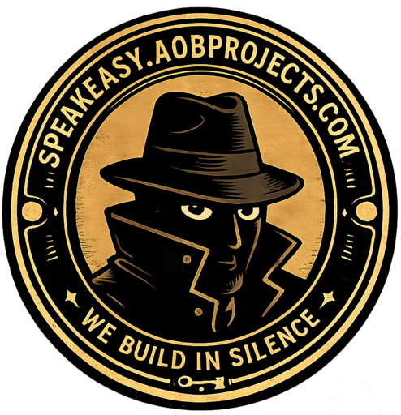
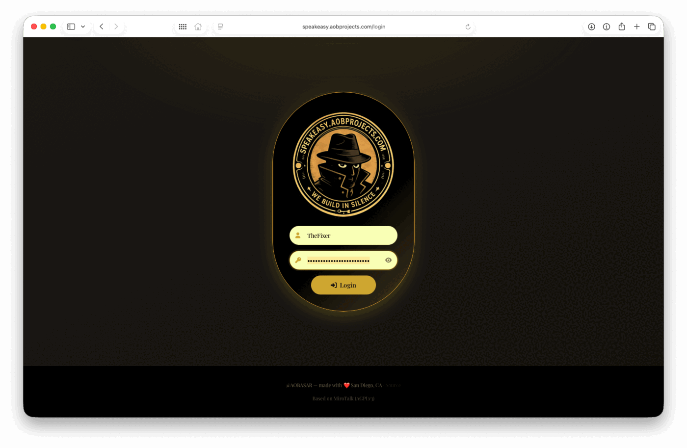
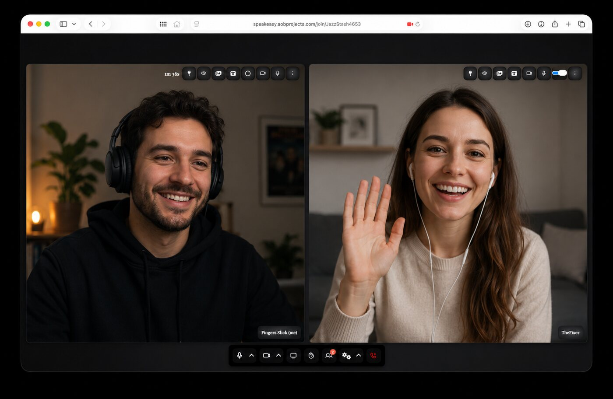
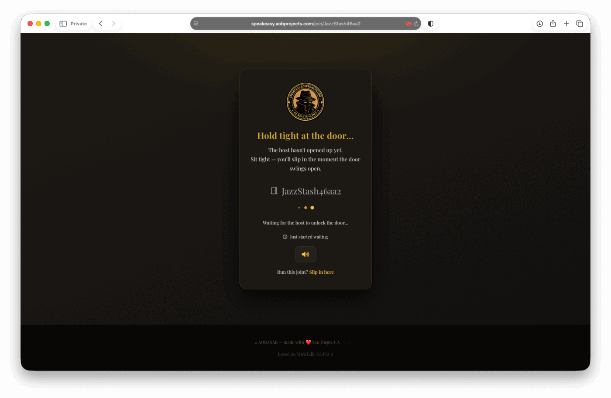

# Speakeasy

**A self-hosted, rebranded fork of [MiroTalk P2P](https://github.com/miroslavpejic85/mirotalk) — AGPLv3**

---

**I did not build the WebRTC platform.** The peer-to-peer video engine, the signalling
server and the underlying feature set are [Miroslav Pejić](https://github.com/miroslavpejic85)'s
work, released as open source under AGPLv3.

What I built is everything wrapped around it: a production deployment on my own
infrastructure, a complete visual and editorial rebrand, a reworked interface, and the
automation that keeps this fork current with upstream instead of letting it rot.

**Live:** <https://speakeasy.aobprojects.com> — host-protected. The host signs in; guests
join through a shared room link, with no account.

---

## Screenshots

**Login**

**In a call**

**Waiting room**

---

## What I changed

### Brand and copy

Every user-facing string was rewritten in `app/src/config.js` — `brand.app`, `brand.og`
and `brand.site`. Page titles, the login screen, the join flow, the waiting room and the
email invitation all carry the Speakeasy voice rather than the upstream product copy.
Logo, favicon set and social preview image were produced from scratch.

### Visual design

|  |  |
| --- | --- |
| **Theme** | The built-in `dark` theme is overridden with an amber/gold palette — 14 CSS custom properties, `#14110E` background, `#D4AF37` accent. New visitors land on it by default. |
| **Typography** | Playfair Display for headings across the client, login and waiting room. |
| **`public/css/aob-login.css`** | 330 lines. Login and waiting-room layout — the pill card, the glow, responsive behaviour. Scoped under an `.aob-auth` body class. |
| **`public/css/aob-custom.css`** | 215 lines. In-call overrides: gold SweetAlert2 buttons, icon hover states, a Font Awesome → [Phosphor Icons](https://phosphoricons.com/) `@font-face` remap, and element hiding. |

Both stylesheets are new files that do not exist upstream, so upstream never touches them.

### Interface — added

- **`public/js/aob-rooms.js`** — themed generators for room names (`JazzStash4653`) and
  aliases (`Fingers Slick`), replacing upstream's UUID room names.
- **"Keep my name secret"** button in the join dialog, plus a randomise button in the
  profile panel — both draw from the alias generator.
- **Automatic avatars** — every participant is assigned and persisted a DiceBear
  `croodles-neutral` avatar on first join, with a 12-avatar picker.
- **Waiting-room music**, with an autoplay attempt and a first-interaction fallback for
  browsers that block it.

### Interface — removed

- Chat, the emoji picker and live captions are switched off in `buttons.main`.
  Whiteboard, recording, screen share and file share stay on.
- Sponsor, advertiser and support blocks are switched off in `brand.html`.
- Roughly 1,100 lines of upstream marketing markup were stripped out of seven HTML views
  and replaced with a single attribution footer.
- Upstream's 25 self-hosted avatars and six mixed DiceBear styles were reduced to one
  coherent style.

### Kept on purpose

- The **About** panel still credits Miroslav Pejić by name, with his contact details and
  copyright line, exactly as upstream ships it.
- Every page footer carries **"Based on MiroTalk (AGPLv3)"** and a **Source** link back to
  this repository.
- `LICENSE` is untouched, and `package.json` still names the original author.

---

## Operations

**Deployment** — [Coolify](https://coolify.io/) builds the `Dockerfile` on every push to
`master` and serves it on port 3000 behind an automatic Let's Encrypt certificate. No
image is published to a registry.

**Health checks** — the container declares a `HEALTHCHECK` against `/brand`, the app's
no-auth config endpoint (30s interval, 5s timeout, 30s start period, 3 retries). If a new
deployment never reports healthy, Coolify keeps the previous container serving traffic
instead of taking the site down.

**Secrets** — every credential and server setting lives in the Coolify environment panel.
Nothing sensitive is committed; `.env` and local notes are gitignored.

**CI** — upstream's Docker Hub publish job was removed from `.github/workflows/ci.yml`.
It would have failed without upstream's registry secrets, and on success it would have
pushed to upstream's own image namespace. The test job stays.

---

## Staying current with upstream

A fork nobody merges is a fork that quietly stops receiving security fixes. This one
merges itself.

`.github/workflows/upstream-sync.yml` runs daily at 04:00 UTC, and on demand:

1. Fetch `miroslavpejic85/mirotalk` `master`.
2. Merge it into this fork's `master`.
3. On a clean merge — push, which triggers a Coolify deploy.
4. **On a conflict — `git merge --abort` and fail the job.** A half-merged tree never
   reaches production, and the failure shows up in the Actions tab.

Conflicts stay rare by design rather than by luck. Customisations are kept where upstream
does not reach:

| Customisation | Location | Conflict risk |
| --- | --- | --- |
| Name, copy, theme, button visibility | `app/src/config.js` | **None** — gitignored upstream, force-added here. Upstream never edits this file. |
| Login / waiting-room / in-call styling | `public/css/aob-*.css` | **None** — new paths that do not exist upstream. |
| Room-name and alias generators | `public/js/aob-rooms.js` | **None** — new file. |
| Health check, sync workflow | `Dockerfile`, `.github/workflows/` | Low — appended, or new files. |
| Footer attribution, view markup | `public/views/*.html` | Low but real — these are upstream-tracked. |

The trade-off: because `config.js` is not tracked upstream, new upstream config keys do
not arrive automatically. `app/src/config.template.js` has to be diffed against it every
so often.

---

## License and attribution

Speakeasy is a derivative work of MiroTalk P2P and is distributed under the **GNU Affero
General Public License v3.0** — the same licence as the original. The full text is in
[`LICENSE`](LICENSE), unmodified.

In practice that means:

- **This repository stays public.** AGPLv3 §13 requires that anyone interacting with the
  software over a network can obtain its source, which is why every page footer links back
  here.
- **Attribution is preserved** — in the About panel, in the footer of every page, and in
  `package.json`.
- **No commercial licence was purchased.** This deployment runs entirely under the free
  AGPLv3 terms.

Upstream's marketing, sponsorship and affiliate links have been removed from this README,
because they belong to upstream and not to this fork. If you want to support the original
project — and you should, it is genuinely good software — do it at the source:

**Original project:** <https://github.com/miroslavpejic85/mirotalk>
**Documentation:** <https://docs.mirotalk.com/>

---

Speakeasy — infrastructure, brand and interface by <a href="https://github.com/aobasar">@aobasar</a>. 
WebRTC platform by <a href="https://github.com/miroslavpejic85">Miroslav Pejić</a>, AGPLv3.

